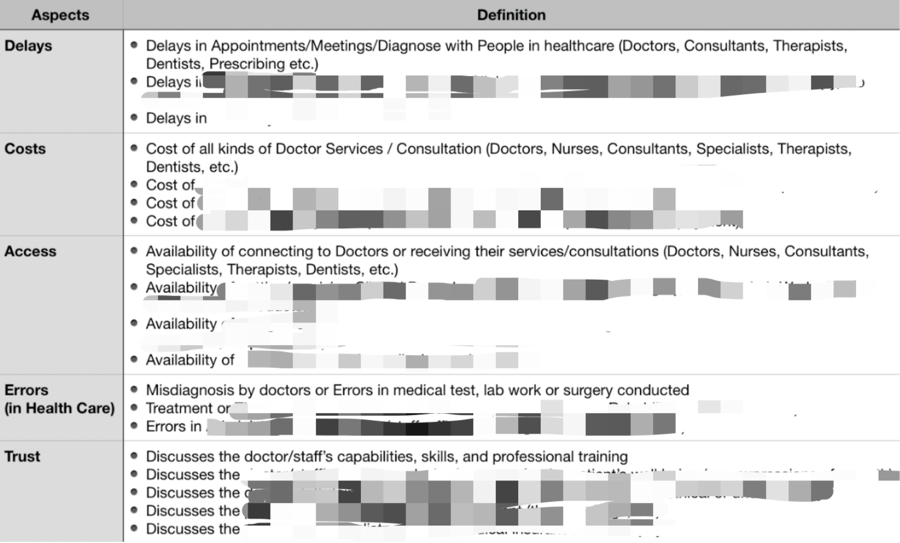

# Medical Sieve: Topic-Based Sentiment Analysis for Patient's Narrative
An End-to-end Topic-based Sentiment Analysis Project for a VC Firm

**Medical Sieve: Top-down to Decipher Patient Sentiment and Unlock Venture Opportunity** 
Topic based sentiment analysis allows us to apply computational linguistics to vast unstructured data sets - and hear what’s really going on in patients’ lives. 

## Background
### Silent Suffering of Patients as a Trigger of Leveraging AI and NLP

You might have been going through depression, anxiety, or any mental issues along this continuing pandemic period, or even gotten caught by the coronavirus itself. Having tried to access all sorts of medical resources, you might have encountered many troubles and the issues were solved well or even properly over the course. This triggered us to think about detecting patients’ sentiment of all different kinds of topics and uncover their latent demand behind the sentiment so as to explore and locate potential business opportunities out there in the medical field. The idea following a sieve-like path, goes from the top, which is raw descriptive text information, to the bottom, the underlining insights and informative knowledge of it. Here is what our topic-based sentiment pipeline comes to play a role and empower us to leverage the core knowledge of resources to opportunity sourcing framework in the VC field.

 
### How AI and NLP Come to Play a Role Here as Our Framework

Artificial Intelligence models with natural language processing (NLP) and distributed big data analysis are the two wheels to land our whole idea on the ground. Given the huge volume of the data to deal with and the feature of unstructured human narrative content, the parallel computing and analytics tool we use like Spark makes the time-consuming pipeline much faster and NLP models seek to clean up the human-generated data, understand and extract value of it. The pipeline project was named Medical-Sieve, which followed the top-down idea that filters valuable information layer by layer from raw data to expose the real knowledge behind. The name just reflects how this framework works systematically and scientifically in our team (Graph below). This innovative pipeline might be one of the few applications in the VC industry. 

  
  <em>Problem Formulation</em>

## Problem Statement

As of the details of the project, different from traditional sentiment analysis as you might have noticed, we analyze sentiment for different topics, which are predicted by two separate model systems.

  
  <em>Problem Formulation</em>

Given each post of patient’s narrative, multi-label classification predicts what types of issues this post mentions. We defined 5 types of issues in healthcare I are interested. Then sentiment classification model predicts the sentiment of the post. We defined 2 different levels of sentiment, i.e. 1. Non-negative; 2. Negative. By this way, it is easier to know the sentiment distribution of tons of posts from different aspects that we defined.

## Case1: Locate Related Topic through Visualization
There are 285 disease groups originally categorized under the discussion forum, as our model identifies both topics and its sentiment of each post of groups refers to, a brain-like visualization, which consists of three dimensions, i.e Disease Group, Topic, and Sentiment,  has been created for a better visual analysis purpose. 

  
  <em>Aspect-Based Sentiment Analysis for 10 Common Disease Categories</em>

Each point stands for a single post of a patient, and all these points are represented by special NLP semantic vectors on their corresponding coordinates. Two sentences are similar in their semantic meaning if they are close on the panel as points, so a cluster of points usually map to a similar topic. Blue points are sentences with specific topics identified by the model, while red color highlights those topic sentences that are identified as negative sentiment. 

Take a cluster on the grid of Cataract on Costs topic, as it is shown below, the red cluster in the circle refers to a topic about patient’s complaints on doctors’ profit-driven behaviors. This is efficient for us to briefly get a sense of various potential issues and  topics among patients within any disease group before a deep dive. We’ve also taken visualization as a look up tool during our meetings with medical startups.

  
  <em>Eg. Cataract on Costs topic</em>

## Case2: Drive insights from Sentiment Dashboard
After being tagged with topics and sentiment, the final database is essentially a rich resource for analysis with metrics. Negative Topic Ratio is one of metrics we used to evaluate how bad patients’ sentiment in a disease group discussion session. Then the yearly change of this ratio was used to rank those disease groups with more negative sentiment this year vs last year on a specific topic aspect than others. These selected groups usually contain valuable information given big changes over years. 

A case here is a group related to Depression problem, which is one of the top movers in its negative ratio of Trust topic among all groups. So we take it as an example to go through all functions. 

  
  <em>Negative Sentiment Ratio Percentile in 2019 vs 2020</em>

A sentiment timeline simply gives us a sense of how patients’ sentiment changes over quarters in a specific disease group. The line chart below illustrates how much worse patients with depression issues were experiencing trust issues against their doctors, treatment, medicines, or the medical system during the period after the national announcement of quarantine when COVID-19 was breaking out globally.

  
  <em>Nagtive Sentiment Timeline of Depression Group</em>

At the same time, based on the rank position of the negative topic ratio for every single disease group, a metric, percentile of negative topic ratio for a disease group among all groups, was created to estimate how much bad this specific topic in the group compared to that in other groups. The higher this score is, the more negative this topic is in this group. As there are five different topics defined, a fingerprint, i.e radar chart, was created to provide a comprehensive description of the sentiment for all different topics in disease groups. Blue score reflects how much hot patients mentioned that specific topic in the group than others, and red score shows how much bad the sentiment on topics is for that disease group.

  
  <em>Radar Chart (Fingerprint) for the Depression Group</em>

The way we selected this group ascribed to its high negative sentiment ratio in trust topic as shown in the fingerprint as well. Representative narrative content of patients is available for reference as well. We are able to know what pinpoints of the topic reveal that negative sentiment and potential insights to be dug in or latent demand to be met.
For instance, some quotes were extracted from the collection of identified posts with trust issue:

>><em>“I lose trust in therapists,I just think it’s hard to find the right therapist. And whoever you choose to see - will not become involved in your feelings”</em>

>><em>“Now finding a good therapist seems to be very hard- someone you connect to , and most importantly , someone who instructs you how to move through life .”</em>

Interestingly, we realized that mental health and its related services being offered now require more spotlights from acute entrepreneurs as well as investors in the market. Our team not only hosted a workshop around the mental health issue for all CEOs of our portfolio companies to help them go through the tough depression days, but also identified several new promising startups which were working well on solving some latent demand of people with mental health issues and providing great online services at the present day. 

## Technical Framework and Details

### Challenges

The first challenge comes from the annotation. We collect data without labels from the biggest patient online forum ([patient.info](https://patient.info/)) in U.K and the U.S. We trained data with ground truth labeled by annotators in the market, so the performance of our model was limited to the quality of this data we collected. The second challenge is the high imbalance of the dataset we created, in which the data from the majority class occupies 87% of the whole data. Then, multi-label classification made our models hard to train, because insufficient minority data might not be learnt by models and the choosing of metrics for loss function and evaluation is a trick during training stage. To generate readable and intuitive visualization based on the output of models and to extract actionable insights from it is another challenge we faced.

### Pipeline

  
  

  <em>Pipeline and Workflow</em>

The diagram left above shows the whole pipeline of our end-to-end project, which includes data preparation, model training, visualization, and analysis. After crawling raw data (patient’s narrative posts) from the forum, we stored data in Amazon S3 and then followed by text processing using Spark. As our models are supervised based, we need to collect ground-truth label of the data, so we collect them through an online service, Amazon Mechanical Turk.  Entity recognition and relation recognition was done for feature engineering then. After generating and finalizing training dataset, models were built using deep learning frameworks: Keras and Pytorch. The model with the best performance was used to generate prediction results for the rest of all data other than training dataset, from which we got a list of meaningful and insightful insights via visualization and statistical analysis.

Also this is a complete end-to-end productionized data science CI/CD pipeline running nowadays in our usual business use case. Right graph of the above shows the general framework followed and implemented.

### Data Preparation

We used Scrapy to collect around 1.3 million patients’ narratives from the biggest patient online forum ([patient.info](https://patient.info/)) in U.K and the U.S. as our dataset. As it is a supervised learning task, we coded all labels we think are important in terms of investment perspective on our own, see table below. In order to annotate our data as quickly and accurately as possible, we designed a survey and sent them out to collect labels on Amazon Mechanical Turk. We embedded a sample of size 5,000 that annotated by our own in the survey with 50,000 posts we sent out to check the performance of workers.

  
  <em>Code of Label for Ground-Truth</em>

Raw texts always contain wrong spelling, redundant punctuations, meaningless information. We filtered punctuations, extended contractions and abbreviations via dictionaries, parsed part of speech, made words lowercase, corrected spelling, and so on. All of these methods are beneficial to the performance of our models.

### The Model

We tried three different kinds of word embeddings: `FastText.300d` embedding (trained on this dataset) and other two popular pre-trained word embeddings, `glove.840B.300d` and `glove.twitter.27B`. It turned out our FastText embedding led to a better performance of models and we ascribed this to more domain-oriented clinical terminologies in the corpus. Below is the T-SNE visualization of the post embedding across 10 common disease topics. We do see some clusters, while the overall clustering effect was not as great as we expected due to noisy posts or general discussions.

  
  <em>Model Instracture</em>

We built an ensembled logistic regression and a neural network with three linear layers as the baseline following works and spent more time on 3 different types of deep learning models as below:

### Performance
After a bunch of experiments and model tuning, Pooled RNN (avg f1: 0.566) and BERT (avg f1: 0.557) led to better performance on the test set. As they caught different things as shown in the accuracy of all data and the accuracy of all data excluding data without any target labels, we ensembled them together to generate the best model that outerfromed than two below (avg f1: 0.571).

  
  <em>Evaluation of Models</em>

## References

1. [Humanizing Customer Complaints using NLP Algorithms](https://towardsdatascience.com/https-medium-com-vishalmorde-humanizing-customer-complaints-using-nlp-algorithms-64a820cef373)
2. [Deep Learning for Sentiment Analysis: A Survey](https://arxiv.org/pdf/1801.07883.pdf)
3. [Can I hear you? Sentiment Analysis on Medical Forums](https://pdfs.semanticscholar.org/1d6b/4edca519259c44307617f2b585ca27f1d4ad.pdf)

